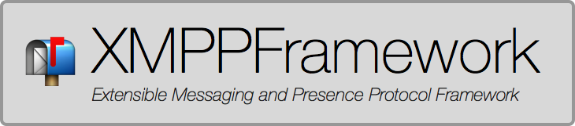

## XMPPFramework
[](https://travis-ci.org/robbiehanson/XMPPFramework) [](https://github.com/robbiehanson/XMPPFramework) [](https://github.com/Carthage/Carthage) [](https://cocoapods.org/?q=XMPPFramework) [](http://opensource.org/licenses/BSD-3-Clause)


An XMPP Framework in Objective-C for the Mac and iOS development community.

### Abstract
XMPPFramework provides a core implementation of RFC-3920 (the XMPP standard), along with the tools needed to read & write XML. It comes with multiple popular extensions (XEP's), all built atop a modular architecture, allowing you to plug-in any code needed for the job. Additionally the framework is massively parallel and thread-safe. Structured using GCD, this framework performs well regardless of whether it's being run on an old iPhone, or on a 12-core Mac Pro. (And it won't block the main thread... at all)

### Install

The minimum deployment target is iOS 8.0 / macOS 10.9 / tvOS 9.0.

### Migration from 3.7 to 4.0

There have been a number of changes to the public API of XMPPFramework in an attempt to improve the ergnomics and safety when used with Swift. Most Objective-C projects should require no changes, with a few minor exceptions. Many (simple) changes will be required for pure Swift projects, mostly due to the new nullability annotations. The process is still not complete so please submit issues and help if possible to minimize future breaking changes.

* Swift Support in XMPPFrameworkSwift.framework and XMPPFramework/Swift subspec
* Modern Objective-C Syntax: Nullability annotations and generics.
* Most of Core, Authentication, Categories, and Utilities have been audited. Additional help is needed for Extensions.
* XMPPJID `bareJID` is now imported into Swift as `bareJID` instead of `bare` to prevent conflict with `bare` String. Also applies to `domainJID`.
* XMPPPresence `intShow` has been renamed `showValue` and is now an `XMPPPresenceShow` enum instead of `int`. This will be a warning in 4.0 but will be removed in 4.1.
* The XMPPMessage `chatState` string value is now imported into Swift as a native Swift String enum when using the Swift extensions. A new `chatStateValue` property is provided for accessing the raw String value in both Swift and Obj-C.
* Readonly properties are used instead of getter methods where applicable. Getter naming overrides for properties have been removed to reflect Apple's approach.
* The following modules still need an audit. If you use these modules please help out and contribute some time to audit them and submit a pull request, otherwise their API may contain breaking changes in future releases.

	* XEP-0191 Blocking
	* XEP-0199 Ping
	* XEP-0202 Time
	* XEP-0136 Archiving
	* XEP-0115 Capabilities (CoreDataStorage unaudited)
	* XEP-0045 MUC (Storage unaudited)
	* XEP-0054 vCardTemp (CoreDataStorage unaudited)
	* XEP-0016 Privacy
	* XEP-0012 Last Activity
	* XEP-0009 RPC
	* Roster (Storage unaudited)
	* XMPPGoogleSharedStatus
	* FileTransfer
	* CoreDataStorage
	* BandwidthMonitor

### Swift Support

XMPPFramework is now accepting contributions written in Swift, with some limitations. Swift code must be isolated in the `Swift/` folder, and none of the existing or future Obj-C code may depend upon it. All public APIs written in Swift must be Obj-C compatible and marked with `@objc`.

See the Contributing section below for more details.

#### CocoaPods

The easiest way to install XMPPFramework is using CocoaPods.

To install only the Objective-C portion of the framework:

```ruby
pod 'XMPPFramework'
```

To use the new Swift additions:


```
use_frameworks!
pod 'XMPPFramework/Swift'
```

After `pod install` open the `.xcworkspace` and import:

```objc
@import XMPPFramework;   // Objective-C
```

```swift
import XMPPFramework     // Swift
```

#### Carthage

To integrate XMPPFramework into your Xcode project using Carthage, specify it in your `Cartfile`:

```
github "robbiehanson/XMPPFramework"
```

Run `carthage` to build the framework and drag the built `XMPPFramework.framework` into your Xcode project. If you'd like to include new features written in Swift, drag `XMPPFrameworkSwift.framework` into your project as well. You'll need to manually `import XMPPFrameworkSwift` in your headers.

### Contributing

Pull requests are welcome! If you are planning a larger feature, please open an issue first for community input. Please use modern Objective-C syntax, including nullability annotations and generics. Here's some tips to make the process go more smoothly:

* Make sure to add any new files to the iOS, macOS, and tvOS targets for `XMPPFramework.framework` in `XMPPFramework.xcodeproj`, and ensure any applicable header files are set to public.
* Please try to write your code in a way that's testable. Using `XMPPMockStream` makes testing pretty easy. Look at examples in `Testing-Shared` for inspiration.
* You will need both CocoaPods and Carthage to work on tests. Run `carthage checkout` in the root of the repository, and `bundle install && bundle exec pod install` in the `Testing-iOS` and `Testing-macOS` folders.
* Create your test files to the `Testing-Shared` folder, and then add them to the iOS, macOS, and tvOS targets in `Testing-Carthage/XMPPFrameworkTests.xcodeproj`, `Testing-macOS/XMPPFrameworkTests.xcworkspace` and `Testing-iOS/XMPPFrameworkTests.xcworkspace`.
* If you plan on writing Swift code, please keep it isolated in the `Swift/` folder, and ensure none of the pure Obj-C code has dependencies on it. All public APIs must be Obj-C compatible and marked with `@objc`. Remember to add your files to the `XMPPFrameworkSwift.framework` target. Ensure that all your unit tests pass for both the CocoaPods and Carthage integrations. For an example, look at `Testing-Carthage/XMPPFrameworkSwiftTests.xcodeproj`, `Testing-Swift/SwiftOnlyTest.swift`, and the `XMPPFrameworkSwiftTests` targets within `Testing-macOS` and `Testing-iOS`.

Looking to help but don't know where to start? 

* A large portion of the framework is not yet annotated for nullability and generics. 
* Adding more test coverage is always appreciated
* Modernizing the old Examples projects

#### Security Issues

If you find a security problem, please do not open a public issue on GitHub. Instead, email one of the maintainers directly:

* [chris@chatsecure.org](mailto:chris@chatsecure.org) [`GPG 50F7D255`](https://chatsecure.org/assets/pubkeys/50F7D255.asc)

### Wiki:
For more info please take a look at the wiki.

- [Overview of the XMPP Framework](https://github.com/robbiehanson/XMPPFramework/wiki/IntroToFramework)
- [Getting started using XMPPFramework on Mac OS X](https://github.com/robbiehanson/XMPPFramework/wiki/GettingStarted_Mac)
- [Getting started using XMPPFramework on iOS](https://github.com/robbiehanson/XMPPFramework/wiki/GettingStarted_iOS)
- [XEPs supported by the XMPPFramework](https://github.com/robbiehanson/XMPPFramework/wiki/XEPs)
- [Learn more about XMPPFramework](https://github.com/robbiehanson/XMPPFramework/wiki)


Can't find the answer to your question in any of the [wiki](https://github.com/robbiehanson/XMPPFramework/wiki) articles? Try the [mailing list](http://groups.google.com/group/xmppframework).

### Donation:

Love the project? Wanna buy me a ☕️? (or a 🍺 😀):

[](https://onename.com/robbiehanson)
[](https://www.paypal.com/cgi-bin/webscr?cmd=_s-xclick&hosted_button_id=CV6XGZTPQU9HY)

